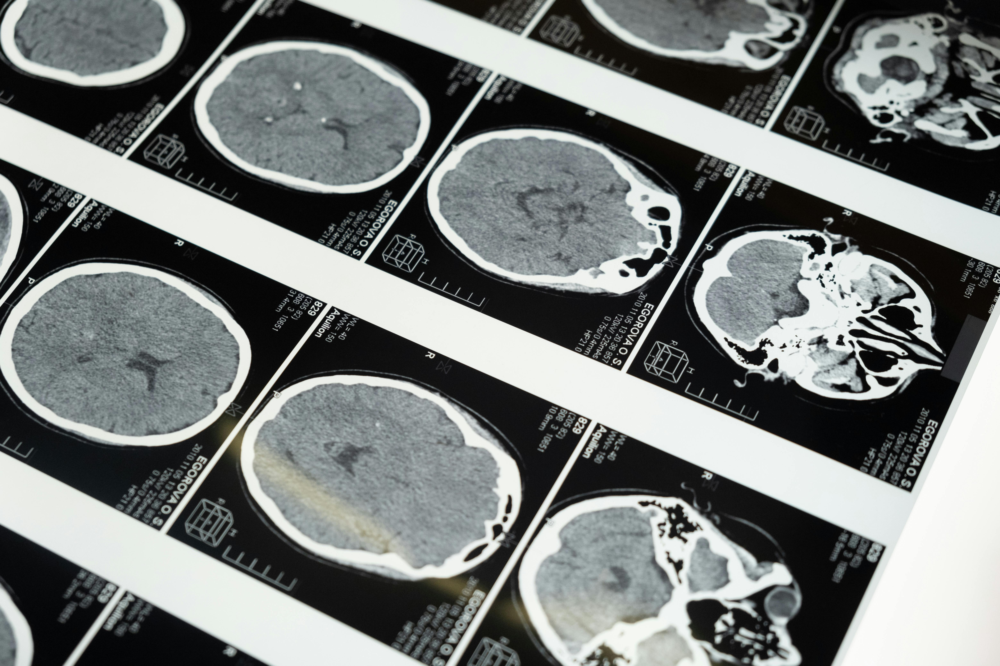

  

# OrganInsight

## Unveiling the Depths of Medical Imaging with AI

### Overview
OrganInsight is a web-based application designed to enhance the accessibility and interpretability of **3D medical imaging** through artificial intelligence. By leveraging a **pre-trained PyTorch model** trained on the **OrganMNIST3D dataset**, the platform classifies 3D organ images with high precision. 

### Features
- **AI-Powered Classification:** Uses a **Hierarchical Attention Mechanism Vision Transformer (ViT)** for accurate organ classification.
- **Interactive Visualization:** A **React-based frontend** enables users to upload and explore 3D medical images.
- **Robust Backend Processing:** A **Python backend** processes images and performs AI-based classification.
- **ChatGPT Integration:** Generates **plain-language explanations** of classification results for better accessibility.
- **User-Friendly Interface:** Designed to bridge the gap between **complex medical imaging** and **easy-to-understand insights**.

### How It Works
1. **Upload a 3D medical image** through the frontend.
2. The **backend processes the image** using the **pre-trained PyTorch model**.
3. The **AI model classifies the organ** in the scan.
4. The results are displayed **alongside the 3D image**.
5. **ChatGPT generates a plain-language description** of the classification.

### Applications
- **Medical Diagnosis:** Supports healthcare professionals in analyzing medical images.
- **Education & Training:** Aids in learning about organ classification and AI-driven imaging.
- **Patient Communication:** Helps convey complex medical information in an understandable format.

### Technologies Used
- **Frontend:** React, Three.js (for 3D visualization)
- **Backend:** Python, Flask, PyTorch
- **AI Model:** Vision Transformer (ViT) trained on OrganMNIST3D
- **Natural Language Processing:** OpenAI ChatGPT API

### Future Enhancements
- Improved **classification accuracy** with additional training datasets.
- Enhanced **3D rendering capabilities** for better visualization.
- Integration of **more AI models** for broader medical imaging applications.

---
OrganInsight is a step toward **making healthcare technology more accessible and user-friendly**, demonstrating the potential of AI in **revolutionizing medical imaging**.
